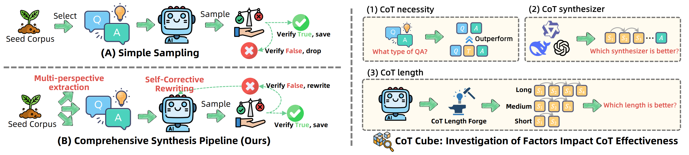
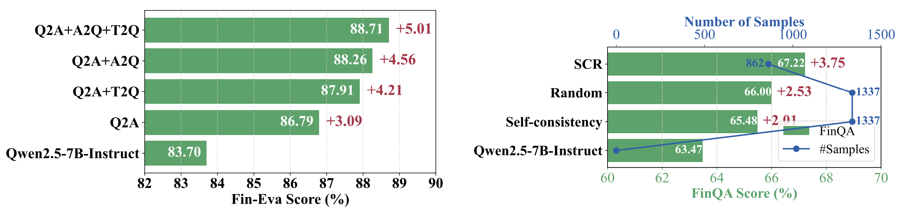

<div align="center">

# Agentar-DeepFinance-100K

<div>
A Large-Scale Financial Dataset via Systematic Chain-of-Thought Synthesis Optimization
</div>
</div>

<div>
<br>

<div align="center">

[](https://huggingface.co/datasets/zwhe99/DeepMath-103K)
[](https://github.com/zwhe99/DeepMath)
[](https://arxiv.org/abs/2504.11456)
</div>

</div>

<div align="center">

**中文** | [**EN**](README.md)

[Hugging Face](<https://huggingface.co/datasets/inclusionAI/Agentar-DeepFinance-100K>) 🤗 [Arxiv](<https://arxiv.org/abs/2507.12901>) 🤖


</div>


## :fire: ​最新动态

- **2025.7.25**  Agentar-DeepFinance-100K的数据已经开源，其中15K的FinCAS安全合规数据，因存在有毒文本，遵循开源惯例未进行开源 🔥🔥🔥
- **2025.7.12** Agentar-DeepFinance-100K的技术报告《Agentar-DeepFinance-100K: A Large-Scale Financial Dataset via
  Systematic Chain-of-Thought Synthesis Optimization》已发布 🚀🚀🚀

## :book: 简介


从通用的推理模型中提炼高质量金融思维链 (CoT) ，为构建金融推理模型提供了一条高效且可行的途径。然而，现有的 CoT 合成方法只是进行简单的浅层采样，导致如何构建一个高质量的金融推理知识空间尚未得到深入研究。为了构建高质量推理数据，我们进行了系统性的CoT合成优化，从三个角度对上述问题进行解决：

**（1）全面的 CoT 合成框架：** 我们的流程引入多视角知识提取 (MKE) 和自反思重写 (SCR) ，以生成详尽而深入的金融推理轨迹。

**（2）“CoT Cube”系统性研究：** 旨在分析影响 CoT 有效性的关键因素，例如必要性、长度和合成器，从而为构建高质量的金融 CoT 提供指导。

**（3）行业专家标注的行业场景QA：** 为了填补与真实世界用户交互的差距，我们还系统地合成了行业场景问题以反映真实世界中需要的金融能力，并由领域专家进行注释。

基于上面的合成优化，我们公开发布 Agentar-DeepFinance-100K，以推动金融推理模型研究。

## :rocket: 全面的CoT合成框架


**1. 多方面知识提取：** 该方法旨在实现详尽而全面的金融推理知识建模，

- `Q2A (Direct Curation)` 直接从种子语料库中获取结构良好的问答对
- `A2Q (Counterfactual Augmentation)` 通过反事实扰动增强关键知识点的因果连通性
- `T2Q (CoT Knowledge Mining)` 挖掘思维链中隐含的推理依赖

**2. 自反思改写：** 为确保数据集的整体准确性，现有方法中的一种常见做法是丢弃缺乏正确采样答案的 QA 对。然而，这些被丢弃的 QA 对通常涉及复杂的推理过程，可以作为提升模型能力的宝贵资源。自反思改写则是将有缺陷的推理轨迹通过适当的纠正机制转化为正确的训练语料。


## 🛠️ “CoT Cube”系统性研究

**1. CoT必要性实验**：无论任务类型和难度如何，加入 CoT 都能持续提高模型性能，特别是在复杂的推理任务和难题中。

| CoT          | Text Gen. | Analysis & Interp. | NLP   | Compliance & Sec. | Math  | Knowledge QA | Average |
|--------------|-----------|---------------------|-------|-------------------|-------|--------------|---------|
| w/o          | 74.55     | 81.36              | 76.71 | 91.25             | 31.71 | 78.32        | 72.32   |
| w/-         | **83.64**| **88.05**          | **77.21** | **92.02**     | **61.15** | **79.01** | **80.18** |

<table>
    <tr>
        <th>Method</th>
        <th>CoT</th>
        <th>FinQA</th>
        <th>Fin-Eva</th>
    </tr>
    <tr>
        <td>Qwen2.5-7B-Instruct</td>
        <td align="center">-</td>
        <td>63.47</td>
        <td>83.70</td>
    </tr>
    <tr>
        <td rowspan="2">Simple</td>
        <td>w/o CoT</td>
        <td>67.65</td>
        <td>84.21</td>
    </tr>
    <tr>
        <td>w/- CoT</td>
        <td><b>68.96</b></td>
        <td><b>85.01</b></td>
    </tr>
    <tr>
        <td rowspan="2">Hard</td>
        <td>w/o CoT</td>
        <td>63.03</td>
        <td>75.80</td>
    </tr>
    <tr>
        <td>w/- CoT</td>
        <td><b>69.31</b></td>
        <td><b>85.96</b></td>
    </tr>
</table>


**2. CoT合成器实验：** 推理模型作为 CoT 合成器的有效性并不总是与其内在的推理性能相一致。在我们的实验中，蒸馏QwQ-Plus获得的CoT质量超过蒸馏DeepSeek-R1的。

<table>
  <thead>
    <tr>
      <th rowspan="2">Model</th>
      <th rowspan="2">Dense</th>
      <th colspan="2">Fin-Eva</th>
      <th colspan="2">FinQA</th>
      <th colspan="2">General</th>
    </tr>
    <tr>
      <th>Acc</th>
      <th>Res. Length</th>
      <th>Acc</th>
      <th>Res. Length</th>
      <th>MATH</th>
      <th>GPQA</th>
    </tr>
  </thead>
  <tbody>
    <tr>
      <td>DeepSeek-R1</td>
      <td>❌</td>
      <td><b>91.42</b></td>
      <td><b>770.14</b></td>
      <td><b>75.41</b></td>
      <td>675.46</td>
      <td><b>98.20</b></td>
      <td>61.62</td>
    </tr>
    <tr>
      <td>QwQ-Plus</td>
      <td>✅</td>
      <td>90.99</td>
      <td>627.43</td>
      <td>72.97</td>
      <td><b>1831.49</b></td>
      <td>97.20</td>
      <td>54.55</td>
    </tr>
    <tr>
      <td>Qwen3-235B-A22B</td>
      <td>❌</td>
      <td>90.01</td>
      <td>428.54</td>
      <td>74.54</td>
      <td>1302.86</td>
      <td>94.60</td>
      <td><b>62.12</b></td>
    </tr>
    <tr>
      <td>Qwen2.5-7B-Instruct</td>
      <td>✅</td>
      <td>83.70</td>
      <td>1.00</td>
      <td>63.47</td>
      <td>239.97</td>
      <td>73.20</td>
      <td>37.88</td>
    </tr>
    <tr>
      <td colspan="8"></td>
    </tr>
    <tr>
      <th rowspan="2">Teacher Model</th>
      <th rowspan="2">#Samples/Avg. Length</th>
      <th colspan="2">Fin-Eva</th>
      <th colspan="2">FinQA</th>
      <th colspan="2">General</th>
    </tr>
    <tr>
      <th>Acc</th>
      <th>Res. Length</th>
      <th>Acc</th>
      <th>Res. Length</th>
      <th>MATH</th>
      <th>GPQA</th>
    </tr>
    <tr>
      <td>DeepSeek-R1</td>
      <td>21,040/1564.63</td>
      <td>85.32</td>
      <td><b>754.54</b></td>
      <td>66.52</td>
      <td>1270.96</td>
      <td>80.00</td>
      <td>41.41</td>
    </tr>
    <tr>
      <td>QwQ-Plus</td>
      <td>19,323/1795.99</td>
      <td><b>85.53</b></td>
      <td>702.41</td>
      <td><b>68.79</b></td>
      <td><b>2196.81</b></td>
      <td><b>81.60</b></td>
      <td><b>42.42</b></td>
    </tr>
    <tr>
      <td>Qwen3-235B-A22B</td>
      <td>20,322/1522.92</td>
      <td>85.45</td>
      <td>640.81</td>
      <td>66.43</td>
      <td>1469.85</td>
      <td>80.00</td>
      <td><b>42.42</b></td>
    </tr>
  </tbody>
</table>

**3. CoT长度实验：** 提炼精简的CoT 可以让训练模型输出更简洁的响应，但也会损害推理能力。金融推理模型需要长 CoT。

<table>
  <thead>
    <tr>
      <th rowspan="2">CoT Length</th>
      <th rowspan="2">Avg. Length</th>
      <th colspan="2">Fin-Eva</th>
      <th colspan="2">FinQA</th>
    </tr>
    <tr>
      <th>Acc</th>
      <th>Res. Length</th>
      <th>Acc</th>
      <th>Res. Length</th>
    </tr>
  </thead>
  <tbody>
    <tr>
      <td>Long</td>
      <td>1352.16</td>
      <td><b>85.53</b></td>
      <td>702.41</td>
      <td><b>68.79</b></td>
      <td><b>2196.81</b></td>
    </tr>
    <tr>
      <td>Medium</td>
      <td>1248.42</td>
      <td>85.40</td>
      <td><b>742.90</b></td>
      <td>65.13</td>
      <td>1698.63</td>
    </tr>
    <tr>
      <td>Short</td>
      <td>1020.26</td>
      <td>85.19</td>
      <td>574.00</td>
      <td>65.56</td>
      <td>1587.76</td>
    </tr>
  </tbody>
</table>

## 🙏 致谢

- **公开数据集**: [FinCorpus](https://huggingface.co/datasets/Duxiaoman-DI/FinCorpus), [Finance-Instruct-500K](https://huggingface.co/datasets/Josephgflowers/Finance-Instruct-500k), [FinCUGE](https://huggingface.co/datasets/Maciel/FinCUGE-Instruction), [FinQA](https://arxiv.org/abs/2109.00122), [FinancialData](https://huggingface.co/datasets/csujeong/financial_data), [Quant-Trading-Instruct](https://huggingface.co/datasets/lumalik/Quant-Trading-Instruct)

- 感谢**长沙数字天蚂信息技术有限公司**、**数字天蚂（重庆）信息技术有限公司**：负责数据标注的运营和管理工作，汇集了充足且专业的金融行业专家标注资源，为提供金融高质量数据的构建提供了有力的保障。

## 📚 引用

```
@misc{zhao2025deepfinance,
      title={Agentar-DeepFinance-100K: A Large-Scale Financial Dataset via Systematic Chain-of-Thought Synthesis Optimization}, 
      author={Xiaoke Zhao and Zhaowen Zhou and Lin Chen and Lihong Wang and Zhiyi Huang and Kaiyuan Zheng and Yanjun Zheng and Xiyang Du and Longfei Liao and Jiawei Liu and Xiang Qi and Bo Zhang and Peng Zhang and Wei Wang and Zhe Li},
      year={2025},
      eprint={2507.12901},
      archivePrefix={arXiv},
      primaryClass={cs.CE},
      url={https://arxiv.org/abs/2507.12901}, 
}
```

## 🤝 联系我们

非常感谢您对Agentar系列的关注！如果您有兴趣向我们的研究团队或产品团队留言，欢迎通过我们的官方邮箱与我们联系：[yanchang.zxk@antgroup.com]。我们的团队将竭诚为您提供帮助和支持。

