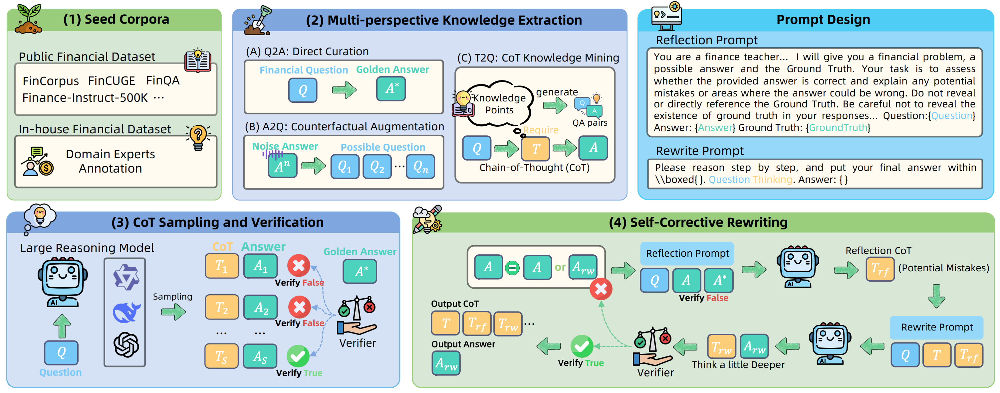

<div align="center">

# Agentar-DeepFinance-100K

<div>
</div>

</div>
<div align="center">
  <h3>一个 · 大规模 · 金融行业深度 · CoT数据集</h3>
</div>
<div>
<br>

<div align="center">

[](https://opensource.org/licenses/Apache-2.0)

[](https://huggingface.co/datasets/inclusionAI/Agentar-DeepFinance-100K)
[](https://arxiv.org/abs/2507.12901)
</div>

</div>

<div align="center">

**中文** | [**EN**](README.md)

</div>



当前，**高质量的金融推理链 (Chain of Thought, CoT)** 是构建金融领域专属推理模型的一条高效且可行的路径。然而，目前主流的 CoT 合成方法通常停留于浅层采样阶段，未能系统性探索如何构建一个高效、深入的金融推理知识体系，导致数据质量和推理深度的提升存在瓶颈。为解决这一问题，我们针对金融推理的复杂需求，设计了一套系统化的 CoT 合成优化方案从而深度挖掘CoT，并从三个核心维度着手，形成 **Agentar-DeepFinance-100K**：

**（1）深度CoT → 知识扩增：** 通过引入**多视角反事实知识提取（Multi-perspective Knowledge Extraction, MKE）技术**，我们从问题、思考过程以及最终回答的多层次内容中，运用反事实扩增策略，生成更加多样化且深入的金融推理链。同时，扩增数据能够更真实地反映金融问题的复杂动态，打造**覆盖多种场景需求**的金融推理轨迹数据。

**（2）深层CoT → 知识抽取：** 我们从**多个维度深入分析影响 CoT 质量的关键要素**，包括CoT的必要性、思维链长度的适配性以及合成器的优化设计。通过精准识别和分析这些要素，我们为高质量金融 CoT 数据的设计奠定了理论基础，同时提供了**一套指导性规则**，用以指导后续更优的推理链生成。

**（3）深融CoT → 人机协同验证：** 面对实际金融业务中的高精度要求，我们进一步设计了结合**人类专家验证与自反思重写（Self-corrective and Rewriting, SCR）技术**的验证环节。具体操作中，对于合成失败的难例，结合模型自反思与领域专家精准注释与校验，通过自反思与领域专家协同标注的方式，我们有效**提升了 CoT 数据的合成成功率与推理精度**，使其更符合真实业务的需求。

基于上述优化流程，我们最终构建了一套高质量的大规模金融推理数据集**Agentar-DeepFinance-100K**，面向金融推理模型的研究与应用开放。通过深度优化数据合成与验证逻辑，该数据集**致力于推动金融推理领域的技术探索**，助力**高效、安全、专业**的金融智能化应用。我们的研究不仅为金融推理链的生成提供了**方法创新**，还为金融大语言模型在深度金融推理领域的应用奠定了坚实基础，为**构建具备更精准能力的金融智能体**提供了重要参考。

## 💎 为什么Agentar-DeepFinance-100K具有行业通用价值？

- **深度与精准并重的CoT数据能力**  

  通过**深度CoT知识扩增技术与CoT知识验证技术**，生成了**高质量、覆盖深度**的推理数据。其数据深度能够有效提升模型在复杂金融场景下的推理和决策能力，无论是高阶金融计算还是合规性分析，都能适配不同机构的多样化业务需求。

- **真实场景驱动的需求贴合**

  数据集由**领域专家严格标注与校准**，确保内容贴近实际业务场景。这种“**场景对齐**”的设计理念，不仅提升了数据集的落地适用性，还显著降低了金融机构智能体部署过程中遇到的“场景适配成本”，推动从实验室成果到实战能力的无缝衔接。

- **方法论的通用性与标准化价值**

  在多维CoT知识抽取环节，针对**推理必要性、文本长度、合成器**等关键指标进行实验，形成了**可复用的“高质量CoT评估框架”**。这一框架不仅对数据集的构建提供了理论支持，更为金融机构自主优化和扩展自身业务场景数据提供了方法论指导，推动行业技术标准化的发展。

- **全链路智能体的能力培育**

  数据集内包含的金融CoT，**覆盖金融分析与解读、金融数学、金融合规与安全**等核心任务模块。这些模块化的推理过程，为训练支持金融业务全流程的“**全链路智能体**”打下了扎实基础，满足金融机构在多任务、多环节智能化需求上的长期追求。

Agentar-DeepFinance-100K的价值不仅在于其数据质量的优秀表现，更在于其以**系统性方法**解决了行业长期面临的“**场景脱节、推理能力不足、数据质量不一**”等难题。通过提供“**可复用、可扩展、可信任**”的底层能力支撑，它为金融智能体的规模化应用铺平了道路，是推动行业智能化升级的重要基石。

## 💻 谁应使用Agentar-DeepFinance-100K?
本数据集适用于：
- **金融智能体研发团队**：验证并提升模型在复杂金融场景中的推理能力，优化金融领域深度推理能力，通过高质量CoT数据集提升智能体解决问题能力，满足多样化业务需求。
- **金融机构技术团队**：降低智能体适配成本，依托实际业务数据快速落地应用，并通过标准化方法扩展自有场景CoT数据，实现技术自主优化。
- **学术研究者**：获取多维金融推理与监管安全的真实场景数据，构建高可信评测环境，推动技术前沿探索与行业标准化。

## 🛠️ “CoT Cube”系统性实验

**1. CoT必要性实验**：无论任务类型和难度如何，加入 CoT 都能持续提高模型性能，特别是在复杂的推理任务和难题中。

| CoT          | Text Gen. | Analysis & Interp. | NLP   | Compliance & Sec. | Math  | Knowledge QA | Average |
|--------------|-----------|---------------------|-------|-------------------|-------|--------------|---------|
| w/o          | 74.55     | 81.36              | 76.71 | 91.25             | 31.71 | 78.32        | 72.32   |
| w/-         | **83.64**| **88.05**          | **77.21** | **92.02**     | **61.15** | **79.01** | **80.18** |

<table>
    <tr>
        <th>Method</th>
        <th>CoT</th>
        <th>FinQA</th>
        <th>Fin-Eva</th>
    </tr>
    <tr>
        <td>Qwen2.5-7B-Instruct</td>
        <td align="center">-</td>
        <td>63.47</td>
        <td>83.70</td>
    </tr>
    <tr>
        <td rowspan="2">Simple</td>
        <td>w/o CoT</td>
        <td>67.65</td>
        <td>84.21</td>
    </tr>
    <tr>
        <td>w/- CoT</td>
        <td><b>68.96</b></td>
        <td><b>85.01</b></td>
    </tr>
    <tr>
        <td rowspan="2">Hard</td>
        <td>w/o CoT</td>
        <td>63.03</td>
        <td>75.80</td>
    </tr>
    <tr>
        <td>w/- CoT</td>
        <td><b>69.31</b></td>
        <td><b>85.96</b></td>
    </tr>
</table>


**2. CoT合成器实验：** 推理模型作为 CoT 合成器的有效性并不总是与其内在的推理性能相一致。在我们的实验中，蒸馏QwQ-Plus获得的CoT质量超过蒸馏DeepSeek-R1的。

<table>
  <thead>
    <tr>
      <th rowspan="2">Model</th>
      <th rowspan="2">Dense</th>
      <th colspan="2">Fin-Eva</th>
      <th colspan="2">FinQA</th>
      <th colspan="2">General</th>
    </tr>
    <tr>
      <th>Acc</th>
      <th>Res. Length</th>
      <th>Acc</th>
      <th>Res. Length</th>
      <th>MATH</th>
      <th>GPQA</th>
    </tr>
  </thead>
  <tbody>
    <tr>
      <td>DeepSeek-R1</td>
      <td>❌</td>
      <td><b>91.42</b></td>
      <td><b>770.14</b></td>
      <td><b>75.41</b></td>
      <td>675.46</td>
      <td><b>98.20</b></td>
      <td>61.62</td>
    </tr>
    <tr>
      <td>QwQ-Plus</td>
      <td>✅</td>
      <td>90.99</td>
      <td>627.43</td>
      <td>72.97</td>
      <td><b>1831.49</b></td>
      <td>97.20</td>
      <td>54.55</td>
    </tr>
    <tr>
      <td>Qwen3-235B-A22B</td>
      <td>❌</td>
      <td>90.01</td>
      <td>428.54</td>
      <td>74.54</td>
      <td>1302.86</td>
      <td>94.60</td>
      <td><b>62.12</b></td>
    </tr>
    <tr>
      <td>Qwen2.5-7B-Instruct</td>
      <td>✅</td>
      <td>83.70</td>
      <td>1.00</td>
      <td>63.47</td>
      <td>239.97</td>
      <td>73.20</td>
      <td>37.88</td>
    </tr>
    <tr>
      <td colspan="8"></td>
    </tr>
    <tr>
      <th rowspan="2">Teacher Model</th>
      <th rowspan="2">#Samples/Avg. Length</th>
      <th colspan="2">Fin-Eva</th>
      <th colspan="2">FinQA</th>
      <th colspan="2">General</th>
    </tr>
    <tr>
      <th>Acc</th>
      <th>Res. Length</th>
      <th>Acc</th>
      <th>Res. Length</th>
      <th>MATH</th>
      <th>GPQA</th>
    </tr>
    <tr>
      <td>DeepSeek-R1</td>
      <td>21,040/1564.63</td>
      <td>85.32</td>
      <td><b>754.54</b></td>
      <td>66.52</td>
      <td>1270.96</td>
      <td>80.00</td>
      <td>41.41</td>
    </tr>
    <tr>
      <td>QwQ-Plus</td>
      <td>19,323/1795.99</td>
      <td><b>85.53</b></td>
      <td>702.41</td>
      <td><b>68.79</b></td>
      <td><b>2196.81</b></td>
      <td><b>81.60</b></td>
      <td><b>42.42</b></td>
    </tr>
    <tr>
      <td>Qwen3-235B-A22B</td>
      <td>20,322/1522.92</td>
      <td>85.45</td>
      <td>640.81</td>
      <td>66.43</td>
      <td>1469.85</td>
      <td>80.00</td>
      <td><b>42.42</b></td>
    </tr>
  </tbody>
</table>

**3. CoT长度实验：** 提炼精简的CoT 可以让训练模型输出更简洁的响应，但也会损害推理能力。金融推理模型需要长 CoT。

<table>
  <thead>
    <tr>
      <th rowspan="2">CoT Length</th>
      <th rowspan="2">Avg. Length</th>
      <th colspan="2">Fin-Eva</th>
      <th colspan="2">FinQA</th>
    </tr>
    <tr>
      <th>Acc</th>
      <th>Res. Length</th>
      <th>Acc</th>
      <th>Res. Length</th>
    </tr>
  </thead>
  <tbody>
    <tr>
      <td>Long</td>
      <td>1352.16</td>
      <td><b>85.53</b></td>
      <td>702.41</td>
      <td><b>68.79</b></td>
      <td><b>2196.81</b></td>
    </tr>
    <tr>
      <td>Medium</td>
      <td>1248.42</td>
      <td>85.40</td>
      <td><b>742.90</b></td>
      <td>65.13</td>
      <td>1698.63</td>
    </tr>
    <tr>
      <td>Short</td>
      <td>1020.26</td>
      <td>85.19</td>
      <td>574.00</td>
      <td>65.56</td>
      <td>1587.76</td>
    </tr>
  </tbody>
</table>

## 🔥 ​最新动态

- **2025.7.25**  **Agentar-DeepFinance-100K数据集**已经开源，其中1K高质量合成精标数据FinRA（financial real annotations, FinRA）、反事实合成与自反思改写数据由于合规审核原因将在后续进行披露，另有15K的FinCAS(financial compliance and security, FinCAS)安全合规数据，因存在有毒文本，遵循开源惯例未进行开源🔥🔥🔥
- **2025.7.24** **Finova金融评测基准**已发布，Finova从智能体执行任务能力、复杂推理能力、安全合规能力这三个真实场景中最受关注的维度来对模型进行考察，其中Agentar-DeepFinance系列CoT数据集对复杂推理能力、安全合规评测能力进行了深度支持🚀🚀🚀
- **2025.7.22** **Agentar-Fin-R1**的技术报告《Agentar-Fin-R1: Enhancing Financial Intelligence through Domain Expertise, Training Efficiency, and Advanced Reasoning》已发布，Agentar-Fin-R1使用了部分Agentar-DeepFinance系列CoT数据集进行训练，Agentar-DeepFinance系列CoT数据集助力Agentar-Fin-R1在所有金融评测基准上——包括Fineva、FinEval、FinanceIQ和蚂蚁数科全新提出的Finova——均达到业界最优水平，超越业界开源金融大模型，也包括GPT-o1、DeepSeek-R1等超大尺寸通用推理模型。 🚀🚀🚀
- **2025.7.12** **Agentar-DeepFinance-100K**的技术报告《Agentar-DeepFinance-100K: A Large-Scale Financial Dataset via
  Systematic Chain-of-Thought Synthesis Optimization》已发布 🚀🚀🚀

## 🙏 致谢
- **公开数据集**: [FinCorpus](https://huggingface.co/datasets/Duxiaoman-DI/FinCorpus), [Finance-Instruct-500K](https://huggingface.co/datasets/Josephgflowers/Finance-Instruct-500k), [FinCUGE](https://huggingface.co/datasets/Maciel/FinCUGE-Instruction), [FinQA](https://arxiv.org/abs/2109.00122), [FinancialData](https://huggingface.co/datasets/csujeong/financial_data), [Quant-Trading-Instruct](https://huggingface.co/datasets/lumalik/Quant-Trading-Instruct)

- 感谢**长沙数字天蚂信息技术有限公司**、**数字天蚂（重庆）信息技术有限公司**：负责数据标注的运营和管理工作，汇集了充足且专业的金融行业专家标注资源，为提供金融高质量数据的构建提供了有力的保障。

## 🔐 数据脱敏说明
为遵循金融数据安全与隐私合规要求，本项目对外开源的版本已对原始数据进行进一步去污去毒处理。因此，基于开源版本数据所进行的训练结果，可能与我们技术报告中公布的完整版结果存在少量差异。

## 📚 引用

```
@misc{zhao2025deepfinance,
      title={Agentar-DeepFinance-100K: A Large-Scale Financial Dataset via Systematic Chain-of-Thought Synthesis Optimization}, 
      author={Xiaoke Zhao and Zhaowen Zhou and Lin Chen and Lihong Wang and Zhiyi Huang and Kaiyuan Zheng and Yanjun Zheng and Xiyang Du and Longfei Liao and Jiawei Liu and Xiang Qi and Bo Zhang and Peng Zhang and Wei Wang and Zhe Li},
      year={2025},
      eprint={2507.12901},
      archivePrefix={arXiv},
      primaryClass={cs.CE},
      url={https://arxiv.org/abs/2507.12901}, 
}
```

## 🤝 联系我们

非常感谢您对Agentar系列的关注！如果您有兴趣向我们的研究团队或产品团队留言，或者想要与我们一起共建金融高质量CoT数据集，欢迎通过我们的官方邮箱与我们联系：[yanchang.zxk@antgroup.com]，我们的团队将竭诚为您提供帮助和支持。

